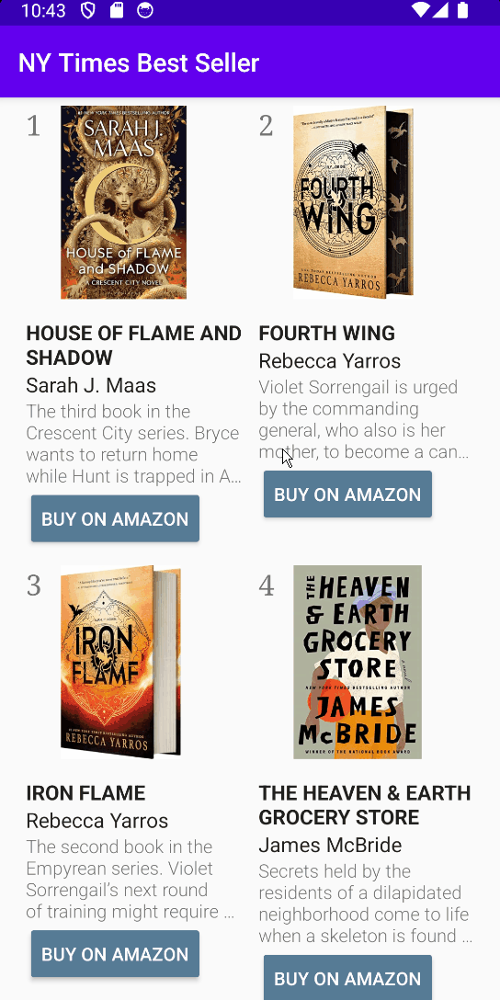

# CS388 - Lab 3: NY Times Bestselling Books

Submitted by: Mehmet Bayram

Time spent: 1-2 hours spent in total

## Required Features

The following **required** functionality is completed:

- [X] allows the user to scroll through a list of books
- [X] Each book includes the book's title, ranking, author, cover image, and description

The following **optional** features are implemented:

- [X] User can click on the buy button to go to the book's amazon page
- [X] The styling is enhanced to match the NY Times website

## Video Walkthrough

Here's a walkthrough of implemented features:

## License

    Copyright 2024 Mehmet Bayram
    
    Licensed under the Apache License, Version 2.0 (the "License");
    you may not use this file except in compliance with the License.
    You may obtain a copy of the License at

        http://www.apache.org/licenses/LICENSE-2.0

    Unless required by applicable law or agreed to in writing, software
    distributed under the License is distributed on an "AS IS" BASIS,
    WITHOUT WARRANTIES OR CONDITIONS OF ANY KIND, either express or implied.
    See the License for the specific language governing permissions and
    limitations under the License.